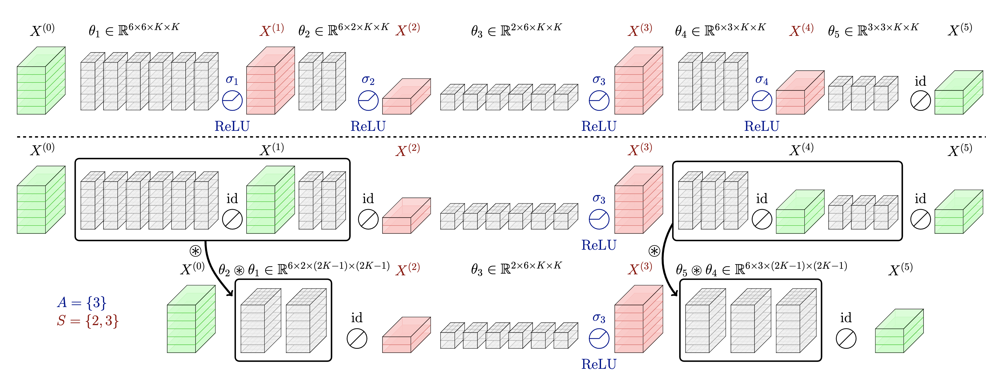

# Efficient-CNN-Depth-Compression
Official PyTorch implementation of **"[Efficient Latency-Aware CNN Depth Compression via Two-Stage Dynamic Programming](https://arxiv.org/abs/2301.12187)"**, published at **ICML'23** (Blog post at **[this link](https://jusjinuk.me/2023/09/11/efficient-cnn-depth-compression.html)**).



> **Abstract** *Recent works on neural network pruning advocate that reducing the depth of the network is more effective in reducing run-time memory usage and accelerating inference latency than reducing the width of the network through channel pruning. In this regard, some recent works propose depth compression algorithms that merge convolution layers. However, the existing algorithms have a constricted search space and rely on human-engineered heuristics. In this paper, we propose a novel depth compression algorithm which targets general convolution operations. We propose a subset selection problem that replaces inefficient activation layers with identity functions and optimally merges consecutive convolution operations into shallow equivalent convolution operations for efficient end-to-end inference latency. Since the proposed subset selection problem is NP-hard, we formulate a surrogate optimization problem that can be solved exactly via two-stage dynamic programming within a few seconds. We evaluate our methods and baselines by TensorRT for a fair inference latency comparison. Our method outperforms the baseline method with higher accuracy and faster inference speed in MobileNetV2 on the ImageNet dataset. Specifically, we achieve 1.41× speed-up with 0.11\%p accuracy gain in MobileNetV2-1.0 on the ImageNet.*

## Requirements
1. Create conda environment and install necessary packages with
      ```bash
      conda env create -f asset/icml23.yml
      conda activate icml23
      pip install -r asset/requirements.txt
      ```
2. If you further want to measure the inference time with TensorRT, install TensorRT with
      ```bash
      pip install nvidia-tensorrt==8.4.3.1
      ```
      Then, download `torch_tensorrt` wheel from this [Link](https://www.dropbox.com/s/0l2w9jyyg1t91bw/torch_tensorrt-1.2.0-cp37-cp37m-linux_x86_64.whl?dl=1) and install it by executing the below command at the directory you downloaded the file.
      ```bash
      pip install torch_tensorrt-1.2.0-cp37-cp37m-linux_x86_64.whl
      ```

## Results on ImageNet
Accuracy and latency speed-up (measured on *RTX2080 Ti*) of compressed architectures.
It is worth noting that we finetune the network after fixing the $A$ and $S$, and then merge the network at the test time.

- **MobileNetV2-1.0** (finetuned 180 epochs)
  | Method | Accuracy | SpeedUp<br/>(TensorRT) | SpeedUp<br/>(*w/o* TensorRT) | $T_0$<br/>(time budget) | 
  | :------: | :-----:  | :----: | :-----: | :----: | 
  | **Pretrained** | 72.89 | 1.00 $\times$ | 1.00 $\times$ |  |  
  | **Ours** | 72.83 | 1.41 $\times$ | 1.62 $\times$ | 25.0 | 
  |          | 72.13 | 1.56 $\times$ | 1.87 $\times$ | 22.1 | 
  |          | 71.44 | 1.77 $\times$ | 2.06 $\times$ | 20.0 | 
  |          | 70.65 | 1.95 $\times$ | 2.46 $\times$ | 18.0 | 

- **MobileNetV2-1.4** (finetuned 180 epochs)
  | Method | Accuracy | SpeedUp<br/>(TensorRT) | SpeedUp<br/>(*w/o* TensorRT) | $T_0$<br/>(time budget) | 
  | :------: | :-----:  | :----: | :-----: | :----: |  
  | **Pretrained** | 76.28 | 1.00 $\times$ | 1.00 $\times$ |  |  
  | **Ours** | 74.68 | 1.61 $\times$ | 1.91 $\times$ | 27.0 | 
  |          | 74.19 | 1.65 $\times$ | 1.97 $\times$ | 26.0 | 
  |          | 73.46 | 1.83 $\times$ | 2.24 $\times$ | 23.0 | 
  |          | 72.57 | 1.99 $\times$ | 2.39 $\times$ | 20.0 | 

- **MobileNetV2-(1.0/1.4)** (finetuned 180 epochs *w/* knowledge distillation)
  | Network | Method | Accuracy | SpeedUp<br/>(TensorRT) | SpeedUp<br/>(*w/o* TensorRT) | $T_0$<br/>(time budget) | 
  | :------: | :-----: | :-----: | :----: | :-----: | :----: |  
  | **MobileNetV2-1.0** | **Pretrained** | 72.89 | 1.00 $\times$ | 1.00 $\times$ |  |
  | | **Ours** | 73.00 | 1.41 $\times$ | 1.62 $\times$ | 25.0 |   
  | |          |       |               |               |      |
  | **MobileNetV2-1.4** | **Pretrained** | 76.28 | 1.00 $\times$ | 1.00 $\times$ |  | 
  | | **Ours** | 75.16 | 1.59 $\times$ | 1.88 $\times$ | 27.5 | 


- **VGG19** (finetuned 20 epochs)
  | Method | Accuracy |  SpeedUp<br/>(*w/o* TensorRT) | $T_0$<br/>(time budget) | 
  | :------: | :----: | :-----: | :----: |  
  | **Pretrained** | 74.24 | 1.00 $\times$ |  | 
  | **Ours**       | 74.33 | 1.44 $\times$ | 160 | 

### Downloading and Evaluating the Checkpoints
1. <a id="1"></a>Download the related checkpoints from below links and unzip the files at the root.
   | Method  | Networks | Finetune | Checkpoints |
   | :------: | :------: | :------: | :------: |
   | **Pretrained** | MobileNetV2-(1.0/1.4), VGG19 |  | [download](https://www.dropbox.com/scl/fi/6dq083xyce6k4tn5zd4bk/pretrained.zip?dl=1&rlkey=mslwbp4zuclt7bdfdmf9oo4lv) |
   | **Ours** | MobileNetV2-1.0 | 180 epochs | [download](https://www.dropbox.com/scl/fi/9t5yvf7cqf0n8p54p4duw/mb_v2_w1.0.zip?dl=1&rlkey=gur149xlvdhdxiej9dk4yybvp) |
   |  | MobileNetV2-1.4 | 180 epochs | [download](https://www.dropbox.com/scl/fi/jvx0ts3v6zzlcntnjw1mk/mb_v2_w1.4.zip?dl=1&rlkey=397q6eir50hrw2fkqv7lp1839) |
   |  | MobileNetV2-(1.0/1.4) | 180 epochs <br/> *w/* knowledge distillation | [download](https://www.dropbox.com/scl/fi/aoef24cgfnlwqaqx78h50/kd_exps.zip?dl=1&rlkey=m617fyfjo712sbl0gy7dcrp01) |
   |  | VGG19 | 20 epochs | [download](https://www.dropbox.com/scl/fi/0hvan7mzmfxck25iyok2y/vgg19.zip?dl=1&rlkey=wywwkz1cs50drfcglffpqkxfr) |

2. <a id="2"></a>You can evaluate the accuracy and the inference time of the networks by below commands.
    - Evaluating the accuracy of the pretrained MobileNetV2-1.0 <br />(`pretrained/mobilenetv2_100_ra-b33bc2c4.pth`)
      ```
      python exps/main.py -a mobilenet_v2 --width-mult 1.0 -d {$IMAGENET_DIR} -m eval -c pretrained/ -f mobilenetv2_100_ra-b33bc2c4.pth
      ```
    - Measuring the inference time of the pretrained MobileNetV2-1.0 <br />(`pretrained/mobilenetv2_100_ra-b33bc2c4.pth`)
      ```
      python exps/inference_trt.py -a mobilenet_v2 --width-mult 1.0 -c pretrained/ -f mobilenetv2_100_ra-b33bc2c4.pth --nclass 1000 --trt False
      ```
    - Evaluating the accuracy of the compressed MobileNetV2-1.0 <br />(`kd_exps/mb_v2_w1.0/tl25.0_dt0.3/checkpoint_ft_lr0.05_merged.pth`)
      ```
      python exps/main.py -a learn_mobilenet_v2 --width-mult 1.0 -d {$IMAGENET_DIR} -m eval -c kd_exps/mb_v2_w1.0/tl25.0_dt0.3/ -f checkpoint_ft_lr0.05_merged.pth
      ```
    - Measuring the inference time of the compressed MobileNetV2-1.0 <br />(`kd_exps/mb_v2_w1.0/tl25.0_dt0.3/checkpoint_ft_lr0.05_merged.pth`)
      ```
      python exps/inference_trt.py -a learn_mobilenet_v2 --width-mult 1.0 -c kd_exps/mb_v2_w1.0/tl25.0_dt0.3/ -f checkpoint_ft_lr0.05_merged.pth --nclass 1000 --trt False
      ```

    - You can further obtain results with other configurations by changing `-a`, `--width-mult` option as the below (and also adjusting `-c`, `-f` option to the correct path).
      - MobileNetV2-1.0, vanilla : `-a mobilenet_v2 --width-mult 1.0`
      - MobileNetV2-1.0, compressed : `-a learn_mobilenet_v2 --width-mult 1.0`
      - MobileNetV2-1.4, vanilla : `-a mobilenet_v2 --width-mult 1.4`
      - MobileNetV2-1.4, compressed : `-a learn_mobilenet_v2 --width-mult 1.4`
      - VGG19, vanilla : `-a vgg19`
      - VGG19, compressed : `-a learn_vgg19`
    - If you want to measure inference time in TensorRT, use `--trt True` option in `exps/inference_trt.py`.

3. Details on the Checkpoints
    - For the pretrained networks in MobileNetV2, we bring the weights from [timm](https://github.com/huggingface/pytorch-image-models/releases/tag/v0.1-weights) and rename the keys. This is the same pretrained weight used in the baseline work ([DepthShrinker](https://github.com/facebookresearch/DepthShrinker/tree/506a163eac38e2fa79a77bf84023c14431cfdcc6)).
    - For the pretrained networks in VGG19, we bring the weights from [torchvision](https://github.com/pytorch/vision/blob/fc83b280387d92fe6aea73f35c1ed4ad1bb739da/torchvision/models/vgg.py#L288) and rename the keys.
    - For the compressed networks, we provide the weights of both *finetuned* and *merged* networks in MobileNetV2, and provide the weights of *merged* networks in VGG19.
    - It is worth noting that we finetune the network after fixing the $A$ and $S$, and then merge the network at the test time. Checkpoints that end with `merged` denotes the weights of the merged networks.

## Solving DP from the Table

### Path to the DP tables
Here, we provide the tables necessary to obtain $A$ and $S$ (ImageNet dataset).
Precisely, we provide
- Optimal time table $T_{\text{opt}}$ (result of soving Algorithm 1 in Section 4):
    - Provided under `utils/table/` directory.
- Normalized & extended importance table $I_{\text{opt}}$ (result of soving Algorithm 3 in Appendix B):
    - Link : [download](https://www.dropbox.com/scl/fi/bcezesccnvf36pgrostxx/exp_result.zip?dl=1&rlkey=rn6sah9gokci2ktaley4tb9el)
    - Download the tables from the link and unzip at the root.

After you unzip the importance tables, you will have necessary files as follows:
| Table  | Networks | Path | 
| :------: | :------: | :------ | 
| $T_{\text{opt}}$ | MBV2-1.0 | `utils/table/mbv2_1.0/opt_time_fish_gpu1_1228.csv` | 
|  | MBV2-1.4 | `utils/table/mbv2_1.4/opt_time_fish_gpu1_0103.csv` | 
|  | VGG19 | `utils/table/vgg19_no_trt/opt_time_fish_gpu1_0317.csv` | 
| $I_{\text{opt}}$ | MBV2-1.0 | `exp_result/dp_imp/mb_v2_w1.0_ie1_ild_cos_ex/ext_importance_s_val_acc_n_single_a_1.6.csv` | 
|  | MBV2-1.4 | `exp_result/dp_imp/mb_v2_w1.4_ie1_ild_cos_ex/ext_importance_s_val_acc_n_single_a_1.2.csv` | 
|  | VGG19 | `exp_result/dp_imp/vgg19_ie1_ild_cos/ext_importance_s_val_acc_n_single_a_1.4.csv` |  


### Obtaining the optimal sets (A and S)
To obtain the optimal sets ($A$ and $S$) for different neural networks, execute the following commands. 
Make sure to specify the time budget ($T_0$) by using the `--time-limit` option in the command.
- **MobileNetV2-1.0**
  ```
  python exps/solve_dp.py \
  -c exp_result/dp_solve/mb_v2_w1.0_ie1_ild_cos_n_single_a_1.6 \
  -f checkpoint.pth \
  --time-limit {$T_0} \
  --act-num 50 \
  --time-path utils/table/mbv2_1.0/opt_time_fish_gpu1_1228.csv \
  --imp-path exp_result/dp_imp/mb_v2_w1.0_ie1_ild_cos_ex/ext_importance_s_val_acc_n_single_a_1.6.csv \
  --prec 20 \
  --chk-time-path utils/table/mbv2_1.0/time_fish_gpu1_1228.csv
  ```
- **MobileNetV2-1.4**
  ```
  python exps/solve_dp.py \
  -c exp_result/dp_solve/mb_v2_w1.4_ie1_ild_cos_n_single_a_1.2 \
  -f checkpoint.pth \
  --time-limit {$T_0} \
  --act-num 50 \
  --time-path utils/table/mbv2_1.4/opt_time_fish_gpu1_0103.csv \
  --imp-path exp_result/dp_imp/mb_v2_w1.4_ie1_ild_cos_ex/ext_importance_s_val_acc_n_single_a_1.2.csv \
  --prec 20 \
  --chk-time-path utils/table/mbv2_1.4/time_fish_gpu1_0103.csv
  ```
- **VGG19**
  ```
  python exps/solve_dp.py \
  -c exp_result/dp_solve/vgg19_ie1_ild_cos_n_single_a_1.4_no_trt \
  -f checkpoint.pth \
  --time-limit {$T_0} \
  --act-num 16 \
  --time-path utils/table/vgg19_no_trt/opt_time_fish_gpu1_0317.csv \
  --imp-path exp_result/dp_imp/vgg19_ie1_ild_cos/ext_importance_s_val_acc_n_single_a_1.4.csv \
  --prec 10 \
  --chk-time-path utils/table/vgg19_no_trt/time_fish_gpu1_0317.csv
  ```
After it completes, you can find the results in the `checkpoint.pth` file, which contains a dictionary with keys `act_pos` and `merge_pos`, corresponding to the set $A$ and $S$.

## Finetuning from the Optimal Sets
Once you have acquired the optimal sets ($A$ and $S$), finetune the network from the pretrained weight after fixing the activation layer and padding following the optimal sets.

If you haven't followed the previous steps, you can download the optimal sets and pretrained weights using the links below:
- Optimal sets ($A$ and $S$) : [download](https://www.dropbox.com/scl/fi/sa60llba72877exg56r9f/exp_result.zip?dl=1&rlkey=a0ecxdghebp4hvlfx5tde5xrv)
- Pretrained weights : [download](https://www.dropbox.com/scl/fi/6dq083xyce6k4tn5zd4bk/pretrained.zip?dl=1&rlkey=mslwbp4zuclt7bdfdmf9oo4lv)

We provide the examples of finetuning commands for each network in the below.
- **MobileNetV2-1.0** (finetuning 180 epochs, $T_0$=25.0)
  ```
  python exps/main.py \
  -a learn_mobilenet_v2 \
  -d {$IMAGENET_DIR} \
  -m finetune \
  --width-mult 1.0 \
  --epochs 180 \
  -c exp_result/dp_ft/mb_v2_w1.0_ie1_ild_cos_n_single_a_1.6/p20.0_tl25.0 \
  -f checkpoint.pth \
  --act-path exp_result/dp_solve/mb_v2_w1.0_ie1_ild_cos_n_single_a_1.6/p20.0_tl25.0/checkpoint.pth \
  --pretrain pretrained/mobilenetv2_100_ra-b33bc2c4.pth \
  --lr 0.05 \
  --aug False
  ```
- **MobileNetV2-1.4** (finetuning 180 epochs, $T_0$=27.0)
  ```
  python exps/main.py \
  -a learn_mobilenet_v2 \
  -d {$IMAGENET_DIR} \
  -m finetune \
  --width-mult 1.4 \
  --epochs 180 \
  -c exp_result/dp_ft/mb_v2_w1.4_ie1_ild_cos_n_single_a_1.2/p20.0_tl27.0 \
  -f checkpoint.pth \
  --act-path exp_result/dp_solve/mb_v2_w1.0_ie1_ild_cos_n_single_a_1.6/p20.0_tl27.0/checkpoint.pth \
  --pretrain pretrained/mobilenetv2_140_ra-21a4e913.pth \
  --lr 0.1 \
  --aug True
  ```
- **VGG19** (finetuning 20 epochs, $T_0$=160.0)
  ```
  python exps/main.py \
  -a learn_vgg19 \
  -d {$IMAGENET_DIR} \
  -m finetune \
  --epochs 20 \
  -c exp_result/dp_ft/vgg19_ie1_ild_cos_n_single_a_1.4_no_trt/p10.0_tl160.0 \
  -f checkpoint.pth \
  --act-path exp_result/dp_solve/vgg19_ie1_ild_cos_n_single_a_1.4_no_trt/p10.0_tl160.0/checkpoint.pth \
  --pretrain pretrained/vgg19_bn-c79401a0.pth \
  --lr 0.01 \
  --aug False
  ```
After it completes, you can find the finetuned weights in the `checkpoint_ft_lr{$LR}.pth` file.
- For optimal sets obtained from different time budgets, specify the path to the `--act-path` option.
- For the knowledge distillation results, append `--distill 0.3` option at the command.

## Merging the Finetuned Network
Once you finetune the network, merge the network from the finetuned weights.
If you haven't followed the previous steps, you can download the finetuned weights using the links in [this bullet](#1).

We provide the examples of merging commands for each network in the below (you might need to adjust `-c` and `-f` option to the proper path if you merge the downloaded checkpoints).
- **MobileNetV2-1.0** (merging $T_0$=25.0)
  ```
  python exps/main.py \
  -a learn_mobilenet_v2 \
  -d {$IMAGENET_DIR} \
  -m merge \
  --width-mult 1.0 \
  -c exp_result/dp_ft/mb_v2_w1.0_ie1_ild_cos_n_single_a_1.6/p20.0_tl25.0 \
  -f checkpoint_ft_lr0.05.pth
  ```
- **MobileNetV2-1.4** (merging $T_0$=27.0)
  ```
  python exps/main.py \
  -a learn_mobilenet_v2 \
  -d {$IMAGENET_DIR} \
  -m merge \
  --width-mult 1.4 \
  -c exp_result/dp_ft/mb_v2_w1.4_ie1_ild_cos_n_single_a_1.2/p20.0_tl27.0_aug \
  -f checkpoint_ft_lr0.1.pth
  ```
- **VGG19** (merging $T_0$=160.0)
  ```
  python exps/main.py \
  -a learn_vgg19 \
  -d {$IMAGENET_DIR} \
  -m merge \
  -c exp_result/dp_ft/vgg19_ie1_ild_cos_n_single_a_1.4_no_trt/p10.0_tl160.0 \
  -f checkpoint_ft_lr0.01.pth
  ```
After it completes, you can find the merged weights in the `checkpoint_ft_lr{$LR}_merged.pth` file.

You can evaluate the accuracy and measure inference time using the commands in [this bullet](#2). 
Make sure to adjust `-c` and `-f` option to a proper path. 
To illustrate, following commands can be used to evaluate each merged network.
- **MobileNetV2-1.0** (evaluating the network merged with $T_0$=25.0)
  - Evaluating the accuracy <br />(`exp_result/dp_ft/mb_v2_w1.0_ie1_ild_cos_n_single_a_1.6/p20.0_tl25.0/checkpoint_ft_lr0.05_merged.pth`)
    ```
    python exps/main.py -a learn_mobilenet_v2 --width-mult 1.0 -d {$IMAGENET_DIR} -m eval -c exp_result/dp_ft/mb_v2_w1.0_ie1_ild_cos_n_single_a_1.6/p20.0_tl25.0/ -f checkpoint_ft_lr0.05_merged.pth
    ```
  - Measuring the inference time <br />(`exp_result/dp_ft/mb_v2_w1.0_ie1_ild_cos_n_single_a_1.6/p20.0_tl25.0/checkpoint_ft_lr0.05_merged.pth`)
    ```
    python exps/inference_trt.py -a learn_mobilenet_v2 --width-mult 1.0 -c exp_result/dp_ft/mb_v2_w1.0_ie1_ild_cos_n_single_a_1.6/p20.0_tl25.0/ -f checkpoint_ft_lr0.05_merged.pth --nclass 1000 --trt False
    ```
- **MobileNetV2-1.4** (evaluating the network merged with $T_0$=27.0)
  - Evaluating the accuracy <br />(`exp_result/dp_ft/mb_v2_w1.4_ie1_ild_cos_n_single_a_1.2/p20.0_tl27.0_aug/checkpoint_ft_lr0.1_merged.pth`)
    ```
    python exps/main.py -a learn_mobilenet_v2 --width-mult 1.4 -d {$IMAGENET_DIR} -m eval -c exp_result/dp_ft/mb_v2_w1.4_ie1_ild_cos_n_single_a_1.2/p20.0_tl27.0_aug/ -f checkpoint_ft_lr0.1_merged.pth
    ```
  - Measuring the inference time <br />(`exp_result/dp_ft/mb_v2_w1.4_ie1_ild_cos_n_single_a_1.2/p20.0_tl27.0_aug/checkpoint_ft_lr0.1_merged.pth`)
    ```
    python exps/inference_trt.py -a learn_mobilenet_v2 --width-mult 1.4 -c exp_result/dp_ft/mb_v2_w1.4_ie1_ild_cos_n_single_a_1.2/p20.0_tl27.0_aug/ -f checkpoint_ft_lr0.1_merged.pth --nclass 1000 --trt False
    ```
- **VGG19** (merging $T_0$=160.0)
  - Evaluating the accuracy <br />(`exp_result/dp_ft/vgg19_ie1_ild_cos_n_single_a_1.4_no_trt/p10.0_tl160.0/checkpoint_ft_lr0.01_merged.pth`)
    ```
    python exps/main.py -a learn_vgg19 -d {$IMAGENET_DIR} -m eval -c exp_result/dp_ft/vgg19_ie1_ild_cos_n_single_a_1.4_no_trt/p10.0_tl160.0/ -f checkpoint_ft_lr0.01_merged.pth
    ```
  - Measuring the inference time <br />(`exp_result/dp_ft/vgg19_ie1_ild_cos_n_single_a_1.4_no_trt/p10.0_tl160.0/checkpoint_ft_lr0.01_merged.pth`)
    ```
    python exps/inference_trt.py -a learn_vgg19 -c exp_result/dp_ft/vgg19_ie1_ild_cos_n_single_a_1.4_no_trt/p10.0_tl160.0/ -f checkpoint_ft_lr0.01_merged.pth --nclass 1000 --trt False
    ```


## Citation
```
@inproceedings{kim2023efficient,
      title={Efficient Latency-Aware CNN Depth Compression via Two-Stage Dynamic Programming}, 
      author={Kim, Jinuk and Jeong, Yeonwoo and Lee, Deokjae and Song, Hyun Oh},
      booktitle = {International Conference on Machine Learning (ICML)},
      year={2023}
}
```
