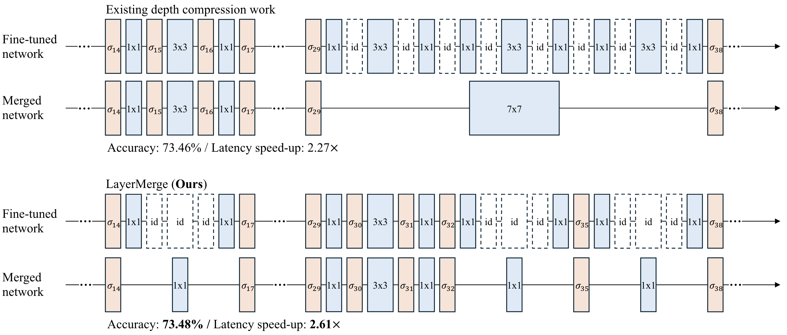

# LayerMerge
Official PyTorch implementation of "LayerMerge: Neural Network Depth Compression through Layer Pruning and Merging", published at **ICML'24**

[**Paper**](https://arxiv.org/abs/2406.12837)



> **Abstract** *Recent works show that reducing the number of layers in a convolutional neural network can enhance efficiency while maintaining the performance of the network. Existing depth compression methods remove redundant non-linear activation functions and merge the consecutive convolution layers into a single layer. However, these methods suffer from a critical drawback; the kernel size of the merged layers becomes larger, significantly undermining the latency reduction gained from reducing the depth of the network. We show that this problem can be addressed by jointly pruning convolution layers and activation functions. To this end, we propose LayerMerge, a novel depth compression method that selects which activation layers and convolution layers to remove, to achieve a desired inference speed-up while minimizing performance loss. Since the corresponding selection problem involves an exponential search space, we formulate a novel surrogate optimization problem and efficiently solve it via dynamic programming. Empirical results demonstrate that our method consistently outperforms existing depth compression and layer pruning methods on various network architectures, both on image classification and generation tasks. We release the code at https://github.com/snu-mllab/LayerMerge.*


## Requirements
1. Create conda environment and install necessary packages with
    ```bash
    conda env create -f lymg.yml
    conda activate lymg
    pip install -r requirements.txt
    pip install -e .
    ```
2. (Optional) If you further want to measure the inference time with TensorRT, install TensorRT with
    ```bash
    pip install nvidia-tensorrt==8.4.3.1
    ```
    Then, download `torch_tensorrt` wheel from this [Link](https://www.dropbox.com/s/0l2w9jyyg1t91bw/torch_tensorrt-1.2.0-cp37-cp37m-linux_x86_64.whl?dl=1) and install it by executing the below command at the directory you downloaded the file.
    ```bash
    pip install torch_tensorrt-1.2.0-cp37-cp37m-linux_x86_64.whl
    ```

## Pre-trained weights

Please download the pre-trained weights from the links provided below and unzip them in the specified paths. 
Each network uses different fine-tuning recipes, so they need to be stored in separate sub-directories.

   | Network  | Path | Checkpoints |
   | :------ | :------ | :------: |
   | ResNet-34 | `HALP/pretrained` | [download](https://drive.google.com/uc?export=download&id=1beaZ8DNesa0t7qO95AgmU-IrxZR2vGMu) |
   | MobileNetV2-(1.0/1.4) | `Efficient-CNN-DepthCompression/pretrained` | [download](https://drive.google.com/uc?export=download&id=1oKuAyWoE6tJsP0DGjfBOd-wv8qPxsUlJ) |
   | DDPM | `Diff-Pruning/exp_code/run/cache` |  [download](https://drive.google.com/uc?export=download&id=1U2_F0D1EqUUNPXsutQ19qQrKMN3WOlIT) |


## 1. Constructing look-up tables & Solving DP algorithm

We provide the DP look-up tables (Latency & Importance) that we employed in the following links.
Unzip the files in the specified paths to proceed to fine-tuning phase with the provided file.

   | Network  | Path | Look-up tables & solutions |
   | :------ | :------ | :---:|
   | ResNet-34 | `HALP/LUT_kim24` | [download](https://drive.google.com/uc?export=download&id=1adYIyKVkM9jWzUpVjGJz5pEaZ7FbjrRJ) |
   | MobileNetV2-(1.0/1.4) | `Efficient-CNN-Depth-Compression/LUT_kim24` | [download](https://drive.google.com/uc?export=download&id=1vSNq9wtllD_GgoX-_CEOJ1taAlDBTGZd) |
   | DDPM |`Diff-Pruning/exp_code/LUT_kim24` | [download](https://drive.google.com/uc?export=download&id=1btwthBrsBy15l5wkV7C-kANiD3P_qXxr) |


We provide the instruction that can obtain tables and solutions above in [DP.md](DP.md).


## 2. Fine-tuning
### ResNet-34
1. Move to `HALP` directory.
    ```
    cd HALP
    ```
2. Install [apex](https://github.com/NVIDIA/apex/tree/58acf96915eecd7e13adff61d2c389fba3efede2) library as follows (you should have GPU and CUDA backend available when you install this package):
    ```
    cd apex
    pip install -v --disable-pip-version-check --no-build-isolation --no-cache-dir ./
    cd ..
    ```
3. To fine-tune with $T_0$ time budget, run
    ```
    python multiproc.py --nproc_per_node {NUM_GPUS} \
    --output_dir output_rtx2080/rn34_kim24layermerge_tl{T_0} main.py \
    --data_root {IMAGENET_DIR} --no_prune \
    --exp configs/exp_configs/rn34_imagenet_baseline.yaml \
    --pretrained pretrained/resnet34_full.pth \
    --depth_path LUT_kim24/solve/rtx2080/rn34/p10_tl{T_0}/checkpoint.pth \
    --depth_method kim24layermerge
    ```
    - Replace `{T_0}` with your desired time budget.
    - Replace `{IMAGENET_DIR}` with imagenet dataset directory.
    - Replace `{NUM_GPUS}` with the number of gpus to utilize. We have conducted our experiments with 8 RTX3090 GPUs and training take up to 6 hours.

- We provide the $T_0$ values and the fine-tuned checkpoints of Table 1 results of the paper below (fine-tuned for 90 epochs).
  | Network | Acc (%) | SpeedUp<br/>(PyTorch) | SpeedUp<br/>(TensorRT) | $T_0$<br/>(Time budget) |
  | :------ | :-----:  | :----: | :-----: | :----: |
  | Pretrained | 74.42 | 1.00 $\times$ | 1.00 $\times$ |  |  
  | LayerMerge-71% | 74.26 | 1.36 $\times$ | 1.25 $\times$ | 146.0 | 
  | LayerMerge-60% | 73.46 | 1.56 $\times$ | 1.50 $\times$ | 123.0 | 
  | LayerMerge-50% | 72.84 | 1.79 $\times$ | 1.72 $\times$ | 103.0 | 
  - Checkpoints: [download]()
  - Unzip the checkpoints at `HALP/output_rtx2080` to proceed on evaluating the fine-tuned checkpoints.
  
### MobileNetV2-(1.0/1.4)
1. Move to `Efficient-CNN-Depth-Compression` directory.
    ```
    cd Efficient-CNN-Depth-Compression
    ```
2. To fine-tune with $T_0$ time budget, 
    ```bash
    # MobileNetV2-1.0
    python exps/main.py -a depth_layer_mobilenet_v2 \
    -d {IMAGENET_DIR} -m finetune --width-mult 1.0 --epochs 180 \
    -c output_rtx2080/p10_tl{T_0} -f checkpoint.pth \
    --act-path LUT_kim24/solve/rtx2080/mbv2/p10_tl{T_0}/checkpoint.pth \
    --pretrain pretrained/mobilenetv2_100_ra-b33bc2c4.pth \
    --lr 0.05 --aug False
    ```
    ```bash
    # MobileNetV2-1.4
    python exps/main.py -a depth_layer_mobilenet_v2 \
    -d {IMAGENET_DIR} -m finetune --width-mult 1.4 --epochs 180 \
    -c output_w1.4_rtx2080/p10_tl{T_0} -f checkpoint.pth \
    --act-path LUT_kim24/solve/rtx2080/mbv2_w1.4/p10_tl{T_0}/checkpoint.pth \
    --pretrain pretrained/mobilenetv2_140_ra-21a4e913.pth \
    --lr 0.1 --aug True
    ```
    - Replace `{T_0}` with your desired time budget.
    - Replace `{IMAGENET_DIR}` with imagenet dataset directory.
    - We have conducted our experiments with 2 RTX3090 GPUs and training take up to 1.5 ~ 2.0 days.
- We provide the $T_0$ values and the fine-tuned checkpoints of Table 2 & 3 results of the paper below (fine-tuned for 180 epochs).
    - MobileNetV2-1.0 (Table 2)
        | Network | Acc (%) | SpeedUp<br/>(PyTorch) | SpeedUp<br/>(TensorRT) | $T_0$<br/>(Time budget) |
        | :------ | :-----:  | :----: | :-----: | :----: |
        | Pretrained     | 72.89 | 1.00 $\times$ | 1.00 $\times$ |  |  
        | LayerMerge-55% | 72.99 | 1.63 $\times$ | 1.42 $\times$ | 22.3 | 
        | LayerMerge-46% | 72.46 | 1.90 $\times$ | 1.65 $\times$ | 18.5 | 
        | LayerMerge-38% | 71.74 | 2.18 $\times$ | 1.84 $\times$ | 15.6 | 
        | LayerMerge-33% | 70.99 | 2.49 $\times$ | 2.05 $\times$ | 13.4 | 
        - Checkpoints: [download](https://drive.google.com/uc?export=download&id=1XKpO2r2LhFnMe2eVDid_LkCvuC-1V6S0)
        - Unzip the checkpoints at `Efficient-CNN-Depth-Compression/output_rtx2080` to proceed on evaluating the fine-tuned checkpoints.
    - MobileNetV2-1.4 (Table 3)
        | Network | Acc (%) | SpeedUp<br/>(PyTorch) | SpeedUp<br/>(TensorRT) | $T_0$<br/>(Time budget) |
        | :------ | :-----:  | :----: | :-----: | :----: |
        | Pretrained     | 76.28 | 1.00 $\times$ | 1.00 $\times$ |  |  
        | LayerMerge-43% | 74.91 | 1.99 $\times$ | 1.61 $\times$ | 26.1 | 
        | LayerMerge-42% | 74.48 | 2.07 $\times$ | 1.73 $\times$ | 25.0 | 
        | LayerMerge-35% | 73.99 | 2.39 $\times$ | 1.93 $\times$ | 21.0 | 
        | LayerMerge-30% | 73.29 | 2.72 $\times$ | 2.12 $\times$ | 18.0 | 
        - Checkpoints: [download](https://drive.google.com/uc?export=download&id=1QSRMmIScjvKp38SNy7m5y4r2nrlnK0ZL)
        - Unzip the checkpoints at `Efficient-CNN-Depth-Compression/output_w1.4_rtx2080` to proceed on evaluating the fine-tuned checkpoints.

### DDPM
1. Move to `Diff-Pruning/exp_code` directory.
    ```
    cd Diff-Pruning/exp_code
    ```
2. To fine-tune with $T_0$ time budget, run
    ```
    python finetune_simple.py \
    --config cifar10.yml --timesteps 100 --eta 0 --ni \
    --exp run/output_rtx2080/ddpm_cifar10/p10_tl{T_0} \
    --doc post_training --skip_type quad --use_ema --use_pretrained --lr 0.0004 \
    --depth_method kim24layermerge \
    --depth_path LUT_kim24/solve/rtx2080/ddpm_cifar10/p10_tl{T_0}/checkpoint.pth
    ```
    - Replace `{T_0}` with your desired time budget.
- We provide the $T_0$ values and the fine-tuned checkpoints of Table 4 results of the paper below (fine-tuned for 100K steps).
    | Network | FID | SpeedUp<br/>(PyTorch) | $T_0$<br/>(Time budget) |
    | :------ | :-----:  | :----: | :----: |
    | Pretrained     | 4.18 | 1.00 $\times$ |  |  
    | LayerMerge-73% | 4.16 | 1.13 $\times$ | 48.0 | 
    | LayerMerge-70% | 4.55 | 1.16 $\times$ | 46.0 | 
    | LayerMerge-58% | 5.61 | 1.27 $\times$ | 38.0 | 
    - Checkpoints: [download](https://drive.google.com/uc?export=download&id=1w9b6AlHBxfWX-vTJVN0lmA6D9dHitHIA)
    - Unzip the checkpoints at `Diff-Pruning/exp_code/output_rtx2080` to proceed on evaluating the fine-tuned checkpoints.

## 3. Evaluating performance & latency speed-up

We provide the instruction that can evaluate the perfomance and latency speed-up in [EVALUATE.md](EVALUATE.md).
Ensure that checkpoints are placed in the correct paths as described in the previous sections.

## Citation
```
@inproceedings{kim2024layermerge,
      title={LayerMerge: Neural Network Depth Compression through Layer Pruning and Merging}, 
      author={Kim, Jinuk and El Halabi, Marwa and Ji, Mingi and Song, Hyun Oh},
      booktitle = {International Conference on Machine Learning (ICML)},
      year={2024}
}
```
